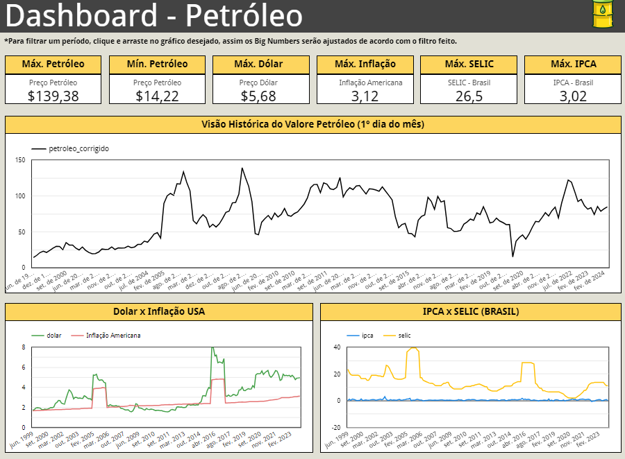
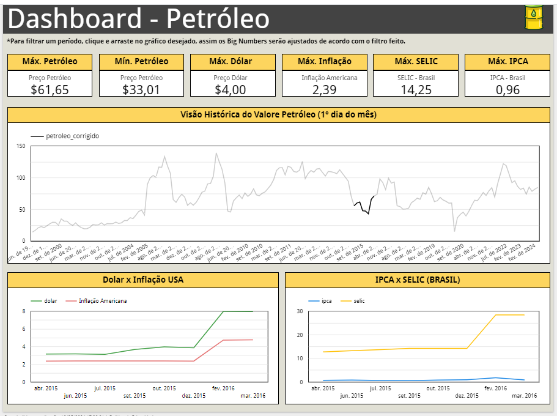
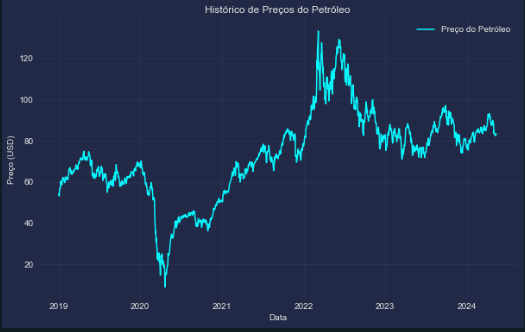
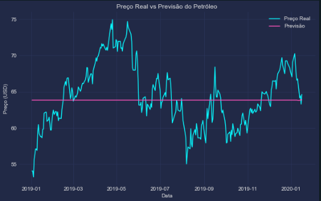
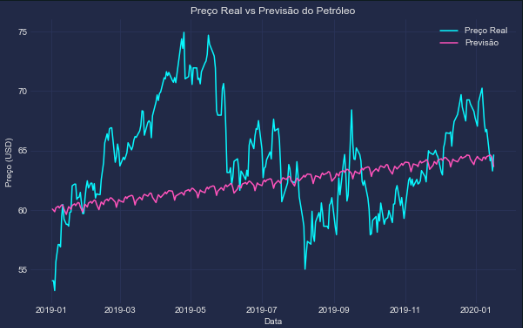

# Trabalho do Tech Challenge - Fase 4

O objetivo do trabalho é: <b>

    1 Criar um dashboard interativo com ferramentas a sua escolha.

    2 Obrigatório trazer pelo menos 4 insights com o Dash.

    3 Criar um modelo de Machine Learning para a previsão do preço do petróleo diariamente.

    4 Criar um plano para fazer o deploy em produção do modelo.

    5 Faça um MVP do seu modelo em produção no Streamlit.

</b>

# Primeira etapa

Para a criação do Dashboard, foi necessária a extratação dos dados de petróleo do site do ipea. Para agregar mais informações, realizei a consulta em outros dados também como:
IPCA, SELIC, cotação do dólar e Inflação Americana.

Dito isso, foi feito todo este processo utilizando o python no arquivo <b>"/extratacao_dos_dados/extracao_dados.ipynb" </b>

Neste arquivo se encontram todas as extratações, tratamentos e carregamentos (ETL). Ao final, foi gerada a base <b>"base_final.csv" </b> onde contem todas as informacoes unificadas em um unico local.

Abaixo segue os sites das fontes de dados que utilizei:

IPEA

    http://www.ipeadata.gov.br/ExibeSerie.aspx?module=m&serid=1650971490&oper=view

BCB (BANCO CENTRAL BRASIL)

    https://opendata.bcb.gov.br/dataset?res_format=API

BLS

    https://www.bls.gov/data/

# Segunda etapa

Foi criado o dashboard com as informações extraídas acima na ferramenta Looker, do Google. Já possuo experiência com Tableau e Power BI, decidi utilizar esta para poder aprender uma ferramenta nova. Para acessar o Dash, acesse: 

    https://lookerstudio.google.com/reporting/dbba5911-b1ee-4287-aaa8-4dbb56949e9e

O Dashboard, possui as visões comparativas no decorrer do tempo e de suas máximas de valores para cada um dos indicadores (Inclui dados apenas do primeiro dia de cada mês para podermos comparar todos os dados de igual para igual). Conforme o print abaixo:

Para selecionar uma período específico, basta ir na visão e clicar de acordo com o que deseja que todas as visões serão ajustadas de acordo. Como por exemplo, selecionando 01/04/2015 até 01/03/2016:

Abaixo segue quatro insights com as visões:

    - Podemos observar que em 01/06/2022, tivemos um pico onde o barril petroleo chegou a U$ 122,20 , quase chegando ao seu preço máximo da história em 01/07/2006 onde foi U$ 139,38 (considerando apeonas os primeiros dias de cada mês).

    - A mínima histórica do valor do petróleo se deu durante a pandemia, chegando a 14,22 em 01/01/2020.

    - Nos últimos 10 anos, percebemos um pico de todos nossos indicadores em 2016 (Valor do Barril do petroleo, SELIC, Inflação americana e cotação do dólar). Após sua estabilização em 2017, vemos que a partir de 2020 tanto a Inflação Americana como o valor do Barril do petróleo vem tem uma tendência de alta. Ponto de atenção nos próximos anos.

    - Enquanto observamos uma tendência de mudança no cenário brasileiro a partir de fevereiro de 2021 (com a subida da selic), vemos que o petróleo, dólar e inflação americana não sofreram com grandes mudanças. 

## Terceira Etapa

Para esta fase, procurei utilizar time series conforme foi indicado na sugestão do trabalho. Para isso, eu criei o seguinte código <b>"modelo/treinamento_modelo.ipynb"</b>.

Neste código, preferi deixar desde a extração dos dados ao treinamento e avaliação dos modelos (por ser mais fácil voltar depois e reprocessar, caso haja necessidade).

Sendo assim, extrai os dados e utilizei apenas os 5 últimos anos para treinar o modelo (incluindo um periodo bem conturbado como a pandemia em 2020).

Gerei esta visão para avaliar o período: 

Sobre o treinamento dos modelos, não inclui as outras variaveis que usei para criar as visões por sentir que não há uma correlação forte o suficiente entre elas a ponto de usar no modelo. Sendo assim, treinei dois modelos. Abaixo coloquei as avaliações de cada um, com uma imagem com sua previsão:
    
    - ARIMA
        MSE: 18.91
        MAE: 3.50

    - SARIMA
        MSE: 24.61
        MAE: 3.85

    Conclusão: Utilizarei o ARIMA, por ter sido melhor avaliado.